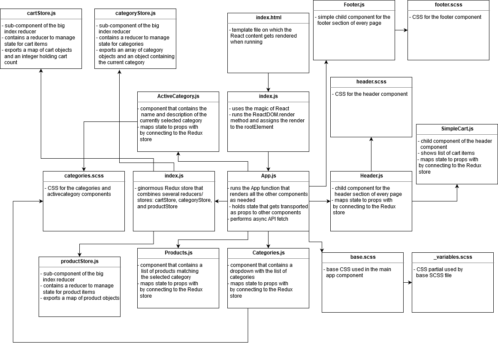

# Lab 31: Redux - Combined Reducers

## E-Commerce Store with Material UI plus Reducer Refactor

Labs 29 and 31 and for CF JS 401 Nights

### Author: Earl Jay Caoile

### Links and Resources

#### Submission Reqs

- [submission PR](https://github.com/earljay-caoile-401-advanced-javascript/redux-ecommerce/pull/2)
- [GitHub actions](https://github.com/earljay-caoile-401-advanced-javascript/redux-ecommerce/actions)
- [code sandbox](https://codesandbox.io/s/github/earljay-caoile-401-advanced-javascript/redux-ecommerce/tree/lab-31)
- [Netlify Deployment](https://nifty-goodall-fcbfde.netlify.app/)

#### Resources

- [Three cards in a row instead of all cards in one column](https://stackoverflow.com/questions/51595156/three-cards-in-a-row-instead-of-all-cards-in-one-column)
- [CSS Gradient](https://cssgradient.io/)

### Documentation

- [React JS Hello World](https://reactjs.org/docs/hello-world.html)
- [SASS](https://sass-lang.com/)
- [Enzyme (Set State)](https://enzymejs.github.io/enzyme/docs/api/ReactWrapper/setState.html)
- [React Font Awesome](https://github.com/FortAwesome/react-fontawesome)
- [JSON Stringify](https://developer.mozilla.org/en-US/docs/Web/JavaScript/Reference/Global_Objects/JSON/stringify)
- [Material UI](https://material-ui.com)

### Setup

- install node packages locally with `npm i` from the root directory in Terminal
- start the server with `npm start`

### Using the App

- from the home page, click the dropdown for the categories
- select different categories and watch the list of products change
- stop at one category and click "add item to cart"
- notice the number on the top right increment by one
- click the top right section of the header with the cart and number next to it and watch simple cart component
  pop out
- increment, decrement, and delete items as much as you'd like
- watch the numbers change after each of your actions
- smile

### UML

